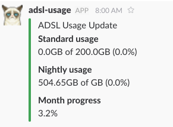

# dsl-stats

A daily ADSL usage reporter via Slack webhooks.



This was one of my first experiments with learning Clojure and _deploying_ an application.

The app uses [clj-http](https://github.com/dakrone/clj-http) and [enlive](https://github.com/cgrand/enlive) to scrape the [MWEB self-service portal](https://myaccount.mweb.co.za/) for ADSL usage information, and reports the numbers via a [Slack webhook](https://api.slack.com/incoming-webhooks). This is done daily at 8:00 with [chime](https://github.com/jarohen/chime) (instead of running via cron).

I had the uberjar running on a VPS for months without any issues.

Although this code is very much what you'd expect from someone learning Clojure, my hope is that it helps by contributing something simple and practical to the corpus of Clojure code available to the public.

## Usage

This project is designed to run as a stand-alone process that will report your daily ADSL usage. Simply create a Slack webhook, a configuration file and compile and you're off to the races.

Create a file named `resources/config.edn` with content like this:

```
{:mweb {:username "nnnnnnnnn"
        :password "topsecret"}
 :slack-webhook "https://hooks.slack.com/services/..."}
```

Then compile an uberjar with `lein uberjar`. The resulting `target/dsl-stats-1.0.0-standalone.jar` can by copied anywhere with a JVM and executed.

```
$ java -jar dsl-stats.jar
```

By default it will run immediately, report usage and exit. To run it in scheduled mode, simply pass `-s`:

```
$ java -jar dsl-stats.jar -s
```

_I had it running in a tmux session._

## Learning Clojure?

If you're learning Clojure, there are some learning opportunities right here in this repo!

* Update the project to support your own ISP.
* Make the schedule configurable via the command line.
* Fix the nightly usage message

## Contribute

Well, I'm not using this anymore, but if you have something please open an issue to discuss.

## License

The MIT License (MIT)

Copyright (c) 2016 Kenneth Kalmer

Permission is hereby granted, free of charge, to any person obtaining a copy of this software and associated documentation files (the "Software"), to deal in the Software without restriction, including without limitation the rights to use, copy, modify, merge, publish, distribute, sublicense, and/or sell copies of the Software, and to permit persons to whom the Software is furnished to do so, subject to the following conditions:

The above copyright notice and this permission notice shall be included in all copies or substantial portions of the Software.

THE SOFTWARE IS PROVIDED "AS IS", WITHOUT WARRANTY OF ANY KIND, EXPRESS OR IMPLIED, INCLUDING BUT NOT LIMITED TO THE WARRANTIES OF MERCHANTABILITY, FITNESS FOR A PARTICULAR PURPOSE AND NONINFRINGEMENT. IN NO EVENT SHALL THE AUTHORS OR COPYRIGHT HOLDERS BE LIABLE FOR ANY CLAIM, DAMAGES OR OTHER LIABILITY, WHETHER IN AN ACTION OF CONTRACT, TORT OR OTHERWISE, ARISING FROM, OUT OF OR IN CONNECTION WITH THE SOFTWARE OR THE USE OR OTHER DEALINGS IN THE SOFTWARE.
